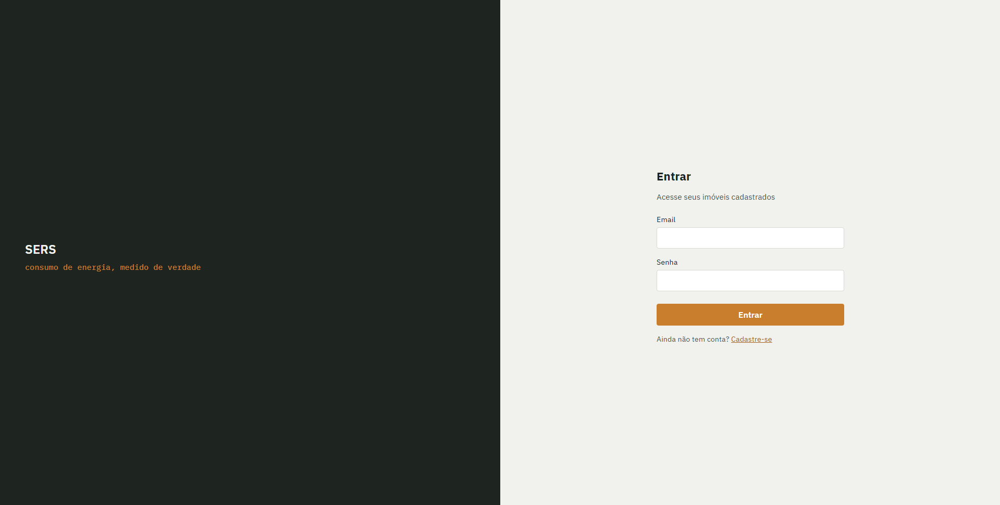
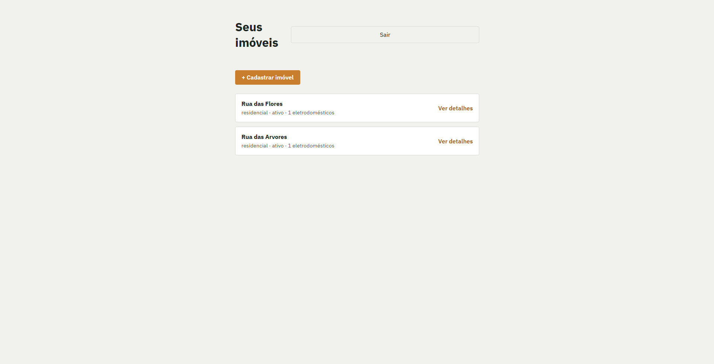
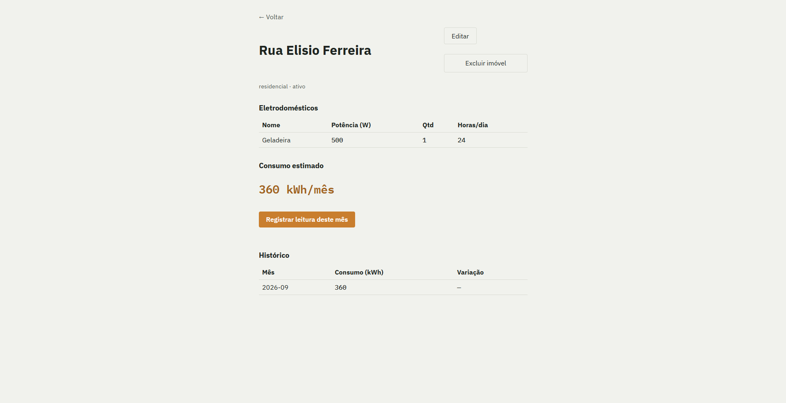

# Cadastro de Energia — SERS

Sistema para cadastro de imóveis e eletrodomésticos, com cálculo e histórico de consumo de energia (kWh). Desenvolvido como projeto acadêmico.

## Equipe

| Nome | Matrícula |
|------|-----------|
| Davi Ramos Silva | 571744 |
| Lucas Galle Melchior | 574027 |
| Gustavo Bonamico Piccoli | 569984 |
| Victor Hugo Ferreira Freire | 571099 |
| Julian Moncoski| 572603 |

📄 [Ver documentação de arquitetura](./ARQUITETURA.md)

## Sobre o projeto

O sistema permite que um usuário se cadastre, registre seus imóveis com os eletrodomésticos de cada um, e acompanhe o consumo estimado de energia (kWh/mês) por eletrodoméstico e por imóvel, além de manter um histórico mensal com comparativos.

## Capturas de tela

| Login | Lista de imóveis | Detalhe do imóvel |
|---|---|---|
|  |  |  |

## Stack tecnológica

- **Backend**: Node.js + Express
- **ORM**: Prisma
- **Banco de dados**: Supabase (PostgreSQL)
- **Frontend**: React (Vite)
- **Autenticação**: JWT + bcrypt

## Estrutura do repositório

```
cadastro-energia-casa/
├── backend/     # API REST (Express + Prisma)
├── frontend/    # Interface (React + Vite)
├── docs/        # Capturas de tela
├── Backlog Projeto SERS.docx
├── ARQUITETURA.md
└── README.md
```

## Como rodar

### Backend

```bash
cd backend
npm install
npx prisma migrate dev --name init
node app.js
```

Preencha o `.env` com `DATABASE_URL` (conexão direta do Supabase, porta 5432) e `JWT_SECRET` antes de rodar.

### Frontend

```bash
cd frontend
npm install
npm run dev
```

## Backlog → Implementação

Mapeamento de cada item do Product Backlog (ver `Backlog Projeto SERS.docx` e `ARQUITETURA.md`) para onde foi implementado no código.

| PB | Solicitado | Onde foi atingido |
|---|---|---|
| **PB01** | Interface de Cadastro (nome, email, senha) | Backend: `authController.js` (`register`), rota `POST /auth/register`. Frontend: `pages/Register.jsx` |
| **PB02** | LogIn com validação dos dados | Backend: `authController.js` (`login`), rota `POST /auth/login`. Frontend: `pages/Login.jsx` |
| **PB03** | Cadastro de Imóveis (infos do imóvel) | Backend: `imovelController.js` (`criar`), rota `POST /imoveis` (cria imóvel + eletrodomésticos juntos). Frontend: `pages/ImovelForm.jsx` |
| **PB04** | Visualização de Imóveis cadastrados (estar logado) | Backend: `imovelController.js` (`listar`), rota `GET /imoveis`, protegida por `middlewares/auth.js`. Frontend: `pages/Dashboard.jsx` |
| **PB05** | Editar/Excluir Imóveis (alterar status) | Backend: `imovelController.js` (`atualizar`, `excluir`), rotas `PUT` e `DELETE /imoveis/:id`. Frontend: `pages/ImovelDetail.jsx` (edição inline e exclusão) |
| **PB06** | Visualização de Consumo (kWh) | Backend: `consumoController.js` (`calcular`), rota `GET /imoveis/:id/consumo`. Frontend: seção "Consumo estimado" em `pages/ImovelDetail.jsx` |
| **PB07** | Análise e armazenamento de dados antigos (comparativos) | Backend: `consumoController.js` (`registrar`, `historico`), rotas `POST`/`GET /imoveis/:id/historico` (com cálculo de variação mês a mês). Frontend: tabela de histórico em `pages/ImovelDetail.jsx` |
| **PB08** | Alerta e Validação de Inconsistências (dados negativos/inválidos/vazios) | Backend: validação de email e senha mínima em `authController.js`; validação de potência/quantidade/horas em `imovelController.js` (`validarEletrodomesticos`). Frontend: limites `min`/`max` nos campos de `pages/ImovelForm.jsx` |
| **PB09** | Proteção dos Dados (privacidade de acesso) | Backend: hash de senha com `bcrypt`, autenticação via JWT em `middlewares/auth.js`, verificação de propriedade do recurso (`usuarioId`) em todas as rotas de imóvel/consumo |
