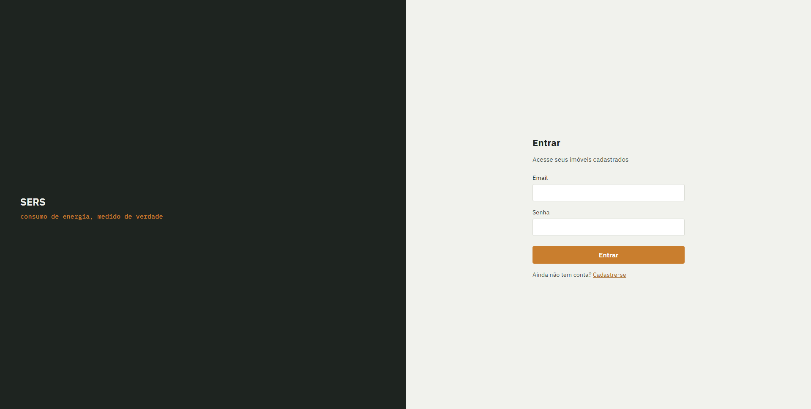
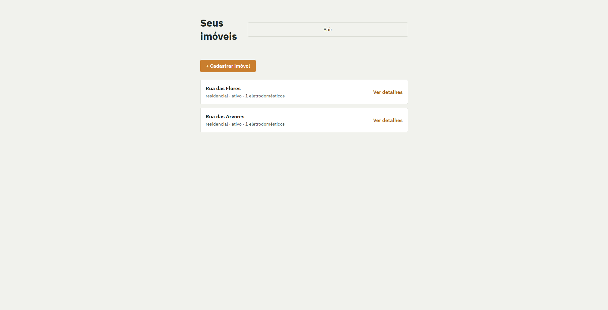
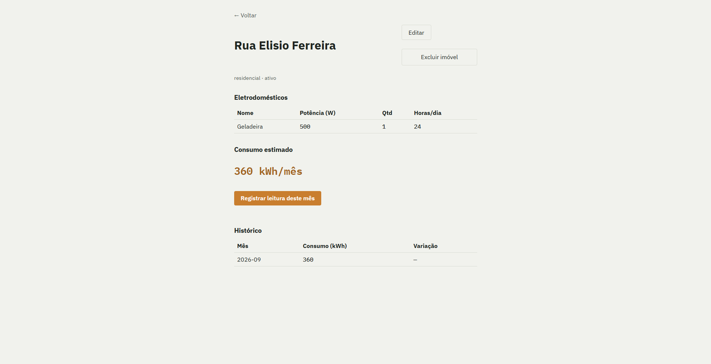

# Cadastro de Energia — SERS

Sistema para cadastro de imóveis e eletrodomésticos, com cálculo e histórico de consumo de energia (kWh). Desenvolvido como projeto acadêmico.

## Equipe

| Nome | Matrícula |
|------|-----------|
| Davi Ramos Silva | 571744 |
| Lucas Galle Melchior | 574027 |
| Gustavo Bonamico Piccoli | 569984 |
| Victor Hugo Ferreira Freire | 571099 |
| Julian Moncoski| 572603 |

📄 [Ver documentação de arquitetura](./ARQUITETURA.md)

## Sobre o projeto

O sistema permite que um usuário se cadastre, registre seus imóveis com os eletrodomésticos de cada um, e acompanhe o consumo estimado de energia (kWh/mês) por eletrodoméstico e por imóvel, além de manter um histórico mensal com comparativos.

## Capturas de tela

| Login | Lista de imóveis | Detalhe do imóvel |
|---|---|---|
|  |  |  |

## Stack tecnológica

- **Backend**: Node.js + Express
- **ORM**: Prisma
- **Banco de dados**: Supabase (PostgreSQL)
- **Frontend**: React (Vite)
- **Autenticação**: JWT + bcrypt

## Estrutura do repositório

```
cadastro-energia-casa/
├── backend/     # API REST (Express + Prisma)
├── frontend/    # Interface (React + Vite)
├── docs/        # Capturas de tela
├── Backlog Projeto SERS.docx
├── ARQUITETURA.md
└── README.md
```

## Como rodar

### Backend

```bash
cd backend
npm install
npx prisma migrate dev --name init
node app.js
```

Preencha o `.env` com `DATABASE_URL` (conexão direta do Supabase, porta 5432) e `JWT_SECRET` antes de rodar.

### Frontend

```bash
cd frontend
npm install
npm run dev
```

## Backlog → Implementação

Mapeamento de cada item do Product Backlog (ver `Backlog Projeto SERS.docx` e `ARQUITETURA.md`) para onde foi implementado no código.

| PB | Solicitado | Onde foi atingido |
|---|---|---|
| **PB01** | Interface de Cadastro (nome, email, senha) | Backend: `authController.js` (`register`), rota `POST /auth/register`. Frontend: `pages/Register.jsx` |
| **PB02** | LogIn com validação dos dados | Backend: `authController.js` (`login`), rota `POST /auth/login`. Frontend: `pages/Login.jsx` |
| **PB03** | Cadastro de Imóveis (infos do imóvel) | Backend: `imovelController.js` (`criar`), rota `POST /imoveis` (cria imóvel + eletrodomésticos juntos). Frontend: `pages/ImovelForm.jsx` |
| **PB04** | Visualização de Imóveis cadastrados (estar logado) | Backend: `imovelController.js` (`listar`), rota `GET /imoveis`, protegida por `middlewares/auth.js`. Frontend: `pages/Dashboard.jsx` |
| **PB05** | Editar/Excluir Imóveis (alterar status) | Backend: `imovelController.js` (`atualizar`, `excluir`), rotas `PUT` e `DELETE /imoveis/:id`. Frontend: `pages/ImovelDetail.jsx` (edição inline e exclusão) |
| **PB06** | Visualização de Consumo (kWh) | Backend: `consumoController.js` (`calcular`), rota `GET /imoveis/:id/consumo`. Frontend: seção "Consumo estimado" em `pages/ImovelDetail.jsx` |
| **PB07** | Análise e armazenamento de dados antigos (comparativos) | Backend: `consumoController.js` (`registrar`, `historico`), rotas `POST`/`GET /imoveis/:id/historico` (com cálculo de variação mês a mês). Frontend: tabela de histórico em `pages/ImovelDetail.jsx` |
| **PB08** | Alerta e Validação de Inconsistências (dados negativos/inválidos/vazios) | Backend: validação de email e senha mínima em `authController.js`; validação de potência/quantidade/horas em `imovelController.js` (`validarEletrodomesticos`). Frontend: limites `min`/`max` nos campos de `pages/ImovelForm.jsx` |
| **PB09** | Proteção dos Dados (privacidade de acesso) | Backend: hash de senha com `bcrypt`, autenticação via JWT em `middlewares/auth.js`, verificação de propriedade do recurso (`usuarioId`) em todas as rotas de imóvel/consumo |

## Evolução Fotovoltaica → Implementação

Segunda fase do backlog (`PBs_Sistema_Fotovoltaico_Tasks.pdf`, PB01–PB20). Os códigos abaixo são os do **novo** backlog fotovoltaico, não os PB01–PB09 da tabela anterior.

| PB | Task | Onde foi atingido |
|---|---|---|
| **PB01** | 1. Reaproveitar consumo cadastrado | `services/dimensionamento.js` (`calcularSugestaoReferencia`: média do histórico → fallback estimativa dos eletrodomésticos); `GET /imoveis/:id/dimensionamento/referencia` |
| | 2. Seleção do imóvel de referência | `frontend/src/pages/Dimensionamento.jsx` (select de imóveis, rota `/dimensionamento/novo/:imovelId?`) |
| | 3. Exibir/ajustar localidade | Campos `cidade`/`uf` em `Imovel` (schema + migration); `ImovelForm.jsx`, `ImovelDetail.jsx` e `Dimensionamento.jsx` |
| | 4. Ajuste manual do consumo (kWh/mês) | `validarConsumoManual` + campo "Ajustar consumo de referência" |
| | 5. Histórico mínimo | `HISTORICO_MINIMO_MESES` (1) em `services/dimensionamento.js` |
| | 6. Bloquear sem referência | `resolverConsumoReferencia` → `400 SEM_CONSUMO_REFERENCIA`; botão desabilitado no frontend |
| **PB02** | 1–2. Campo de percentual, padrão 100% | `Dimensionamento.jsx`; `PERCENTUAL_PADRAO` |
| | 3–4. Validar 1–100%, rejeitar negativos/não numéricos | `validarPercentual` (backend) + validação espelhada no frontend |
| | 5. Persistir com o cenário | Model `CenarioDimensionamento`; `POST/GET/PUT /imoveis/:id/cenarios` |

Testes unitários das regras: `cd backend && npm test`. Após puxar estas mudanças, rode `npx prisma migrate dev` para aplicar a migration `dimensionamento_cenario`.
| **PB03** (fotovoltaico) | 1. Dataset de HSP | `backend/data/hsp_por_uf.csv` (27 UFs, com região e fonte), carregado e validado por `services/hsp.js` (`carregarTabelaHsp`) |
| | 2. Associar HSP à localidade | `obterHspPorUf` / `resolverHsp`; `GET /dimensionamento/hsp?uf=`; HSP gravado no cenário (`hspKwhM2Dia`) |
| | 3. Sobrescrita manual | Campo "Sobrescrever HSP" em `Dimensionamento.jsx`; `PUT` aceita `hspKwhM2Dia` e `usarHspTabela` |
| | 4. Registrar e exibir fonte | Campos `hspOrigem` e `hspFonte` no cenário, exibidos na tela |
| | 5. Faixa plausível | `HSP_MIN = 3` e `HSP_MAX = 6.5` em `services/hsp.js` (backend e frontend) |
| **PB04** (fotovoltaico) | 1. Fórmula E_FV = C_m × f | `calcularEnergiaFv` em `services/dimensionamento.js` |
| | 2. Validar C_m e f | Mesma função (C_m > 0; f entre 1% e 100%) |
| | 3. Exibir em kWh/mês | Seção "Energia mensal a gerar" em `Dimensionamento.jsx` |
| | 4. Recalcular ao alterar parâmetro | Ao vivo no frontend; `PUT /imoveis/:id/cenarios/:cenarioId` recalcula e persiste |
| | 5. Log/evidência | Model `CenarioCalculoLog`; `GET /imoveis/:id/cenarios/:cenarioId/logs`; botão "Ver memória de cálculo" |

Atenção: os valores de `hsp_por_uf.csv` são médias anuais aproximadas por UF e devem ser conferidos no CRESESB SunData antes de entrega formal.

### PB12–PB15 — autonomia e baterias

- PB12 valida autonomia positiva de 1 a 72 horas quando o cenário usa armazenamento.
- PB13 calcula `E_d = C_m / 30`, `E_autonomia = E_d × (A / 24)` e a capacidade nominal estimada com DoD padrão de 80% e eficiência de bateria padrão de 90%. Esses dois padrões são premissas ajustáveis do modelo do projeto; o DoD do equipamento selecionado vem do dataset.
- PB14 usa `backend/data/baterias.csv`, com dados técnicos e preços consultados em 02/10/2026. Os links das fichas dos fabricantes e das listagens de preço acompanham cada registro.
- PB15 aplica o DoD do modelo selecionado uma única vez: `N_bat = ceil((E_autonomia / η_bat) / (C_nominal × DoD))`. A API devolve capacidade instalada, custo estimado e memória de cálculo.
- O catálogo é servido em `GET /dimensionamento/baterias`. Cenários com armazenamento exigem seleção para novos cadastros; cenários antigos sem bateria selecionada seguem consultáveis e podem ser completados ao atualizar.
- Para aplicar os novos campos e regenerar o Prisma Client, execute `cd backend && npx prisma migrate dev`.

### PB16–PB20 — compatibilidade, orçamento e cenários

- `backend/data/inversores.csv` identifica inversores híbridos e as baterias explicitamente suportadas. A combinação de bateria com inversor incompatível retorna erro e alternativas cadastradas. O conjunto documentado inclui Deye SUN-5K-SG04LP1-EU com Dyness B4850; confirme sempre a matriz de compatibilidade do fabricante antes de fechar a proposta.
- `backend/data/paineis.csv` contém três módulos com dados técnicos e preços de varejo consultados em 02/10/2026. As fontes técnicas e de preço ficam no próprio CSV.
- O dimensionamento de potência usa `P_FV = E_FV / (HSP × D × η)`, com `D = 30` dias e eficiência global `η = 75%` por padrão; ambos são editáveis no cenário (`D` entre 1 e 31 dias). O número de módulos é arredondado para cima. A potência instalada é comparada com a potência calculada; este cálculo preliminar não valida arranjos elétricos em série/paralelo.
- O orçamento de equipamentos soma módulos, inversor e baterias. Estrutura, cabeamento, proteções e instalação são campos manuais, com padrão R$ 0,00; a tela permite registrar a fonte/premissa. O total geral soma equipamentos e esses itens.
- `GET /dimensionamento/paineis` e `GET /dimensionamento/inversores` expõem os catálogos autenticados. `GET /imoveis/:id/cenarios` lista somente os cenários do imóvel pertencente ao usuário autenticado; os valores e logs ficam persistidos.
- A migration `20261002140000_integracao_orcamento` adiciona dimensionamento e orçamento ao cenário. Rode `cd backend && npx prisma migrate dev` para aplicar e regenerar o Prisma Client.

